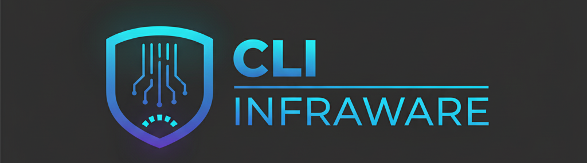

#  InfraWare 🛡️ - Your IaC Security and Quality Scanner

InfraWare is a powerful, rule-based command-line tool designed to scan Infrastructure as Code (IaC) for security vulnerabilities, misconfigurations, and code quality issues. It analyzes Terraform plan files to provide the most accurate assessment of your planned infrastructure changes.


*(Tip: You can use a tool like [ScreenToGif](https://www.screentogif.com/) or [Peek](https://github.com/phw/peek) to create a simple GIF of your tool in action and replace the placeholder above.)*

## ✨ Key Features

* **Accurate Plan Scanning**: Analyzes the JSON output of `terraform plan` to understand the exact state of your infrastructure, including modules and variables.
* **Extensible Rule Engine**: Define security and quality checks in simple, human-readable YAML files.
* **Professional CLI**: A full-featured command-line interface with commands for scanning and rule management.
* **Interactive Rule Creation**: Use `infraware rules create` to be guided through making new rules.
* **Rule Validation**: Use `infraware rules validate` to check your custom rule files for correct syntax.
* **Ignore Findings**: Baseline your infrastructure by ignoring specific findings using simple ignore files.
* **Formatted Output**: Clean, color-coded console output makes it easy to spot issues.

## 📋 Prerequisites

* [Python](https://www.python.org/downloads/) (version 3.8 or higher)
* [Terraform](https://developer.hashicorp.com/terraform/downloads) (version 1.0 or higher)

## 🚀 Installation

To install and use the InfraWare CLI, follow these steps:

1.  **Clone the Repository**:
    ```bash
    git clone [https://github.com/your-username/infraware.git](https://github.com/your-username/infraware.git)
    cd infraware
    ```

2.  **Install the Package**:
    This command uses the `pyproject.toml` file to install the `infraware` command and its dependencies.
    ```bash
    pip install .
    ```

3.  **Verify Installation**:
    Check that the command is available in your path.
    ```bash
    infraware --help
    ```

## 🔬 Usage Guide

InfraWare is designed to fit into your standard Terraform workflow.

### Scanning a Terraform Project

1.  **Navigate to Your Terraform Project**:
    `cd` into the directory containing your `.tf` files.

2.  **Initialize Terraform**:
    If you haven't already, initialize Terraform to download providers and modules.
    ```bash
    terraform init
    ```

3.  **Generate the JSON Plan**:
    Create a binary plan file and convert it to a readable JSON format.
    ```bash
    terraform plan -out=tfplan.binary
    terraform show -json tfplan.binary > tfplan.json
    ```

4.  **Run the Scanner**:
    Now, use the `infraware` command to run the scan.
    ```bash
    infraware scan ./tfplan.json --rules-dir /path/to/your/rules --ignore-dir /path/to/your/ignores
    ```
    **Example**:
    ```bash
    infraware scan ./tfplan.json --rules-dir ~/dev/infraware/rules --ignore-dir ./infraware-ignores
    ```

### Managing Rules

InfraWare includes a full suite of commands to help you manage your rules.

#### **Listing Rules**
See all rules in a directory in a clean table format.
```bash
infraware rules list --rules-dir ./my-rules
```

#### **Validating Rules**
Check a directory of rule files for correct syntax and structure.
```bash
infraware rules validate --rules-dir ./my-rules
```

#### **Creating a Rule Interactively**
Be guided through creating a new rule, which will be saved to a new YAML file.
```bash
infraware rules create --rules-dir ./my-rules
```

## 📄 Rule and Ignore File Formats

#### **Rule File Format**
Rules are defined in YAML files. A single file can contain a list of multiple rules.

*Example (`rules/aws_s3_public.yaml`):*
```yaml
- id: AWS-S3-001
  severity: HIGH
  description: "S3 bucket has a public read ACL."
  resource: "aws_s3_bucket"
  attribute: "acl"
  value: "public-read"
```

#### **Ignore File Format**
Ignore files allow you to baseline findings. A finding is ignored if the resource's **name** matches.

*Example (`ignores/s3-exceptions.yaml`):*
```yaml
ignore:
  - resource_name: "my_public_website_bucket"
    reason: "This bucket is for a public website and is intentionally public."
```

## 🛠️ Development Setup

Interested in contributing to InfraWare? Here’s how to set up for development.

1.  **Clone the Repository**:
    ```bash
    git clone [https://github.com/your-username/infraware.git](https://github.com/your-username/infraware.git)
    cd infraware
    ```
2.  **Create and Activate a Virtual Environment**:
    ```bash
    python -m venv venv
    source venv/bin/activate  # or .\venv\Scripts\activate on Windows
    ```
3.  **Install in Editable Mode**:
    Install the project in "editable" mode (`-e`). This allows you to make changes to the source code and see them reflected immediately without reinstalling.
    ```bash
    pip install -e .
    ```

## 🤝 Contributing

Contributions are welcome! Please feel free to open an issue to discuss a new feature or submit a pull request.

## 📜 License

This project is licensed under the MIT License. See the `LICENSE` file for details.
